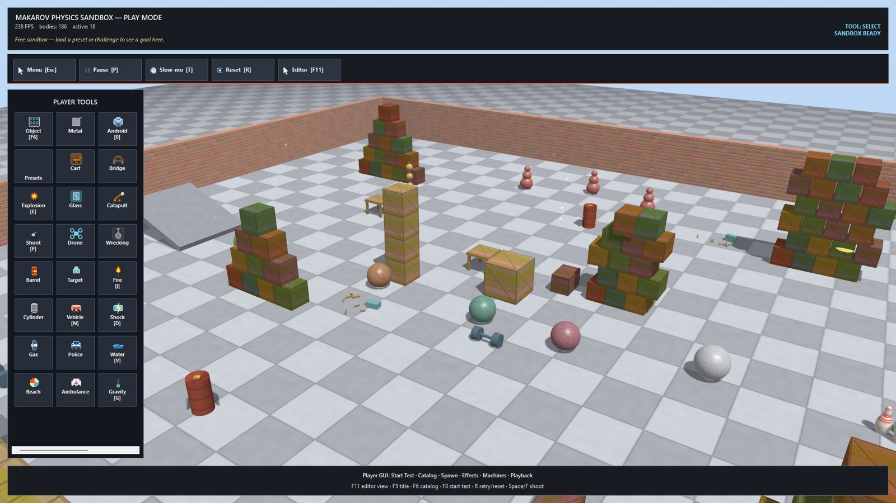
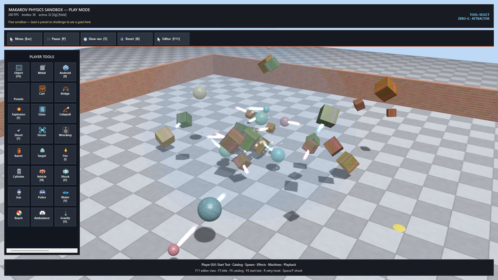

# Makarov Physics Sandbox (Wrecksmith)

A 3D rigid-body physics sandbox about building chaotic contraptions and watching
them fall apart — written in **pure C#** with **zero external dependencies**.
No game engine, no physics library, no math library, no windowing framework:
a hand-written sequential-impulse constraint solver, a hand-written OpenGL
renderer (P/Invoke to `opengl32`), a native Win32 window with its own message
loop, and GDI+ only for PNG decoding.





## What's inside

### Physics engine (`Physics/`)

- **Bodies**: spheres, boxes, capsules and **compound bodies** (multiple child
  shapes per rigid body). Origin moved to the centre of mass; full **inertia
  tensors** built via the parallel-axis theorem with a custom 3x3 matrix type.
- **Solver**: sequential impulse, fixed step 1/120 s, 10 iterations. **Warm
  starting** (cached impulses re-anchored in the body's local frame) so stacks
  settle instead of buzzing. **Split-impulse** (pseudo-velocity) position
  correction so penetration fixes don't inject energy. Friction via two tangent
  directions per contact. Rolling resistance so balls coast to rest.
- **Broad phase**: uniform **spatial hash**, with a separate "huge body" path
  for arena walls so they don't blow up the cell size.
- **Sleeping**: bodies below linear+angular thresholds nod off; impacts and
  force fields wake them.
- **Joints**: point (ball-socket), distance (rigid rod), rope (resists stretch
  only), spring — solved in the same loop as contacts, world-anchored when one
  body is null.
- **Force fields**: attractor, repeller, wind — mass-independent accelerations
  with linear falloff.
- **Water** (`WaterVolume`): Archimedes buoyancy from per-body density,
  depth-scaled drag, animated wavy surface with object-driven ripples.
- **Destruction**: breakable bodies fracture into smaller pieces above an
  impact threshold; an impacts channel drives sparks, sounds and damage.
- **Queries**: ray casts against all shape types, radial explosions with lift
  bias, grab-spring dragging.

### Simulation systems

- **Ragdolls** (`Ragdoll.cs`): articulated humanoids built from bodies and
  point joints, with per-joint **pose muscles**, localized blunt damage,
  dismemberment and death — all on top of the public physics API, no solver
  changes.
- **Fire & heat** (`Heat.cs`): per-body temperature, fuel and flammability;
  fire spreads by contact/proximity, chars bodies, burns ragdoll bones and
  interacts with water and density.
- **Electricity** (`Electricity.cs`): charge propagates across conductive and
  wet bodies through the contact graph.
- **Materials** (`Material/`): wood, metal, rubber, glass, stone, foam, ice,
  plastic, synthetic, explosive — each sets density, friction, bounciness,
  breakability, flammability, conductivity and explosive power, so the
  interaction matrix (fire x wood, current x metal x water, blast x fragile...)
  emerges from data.
- **Mechanisms & triggers** (`Mechanisms.cs`, `Core/SceneTrigger.cs`): motors,
  gates, timers, conveyors, pistons, sliding doors, plus pressure-plate
  triggers whose outputs target mechanisms by id with per-output delays — full
  timed chain reactions with visible wiring. See `PRESET_GUIDE.md`.
- **Campaign** (`Campaign/`): a level catalog with challenges, star ratings and
  JSON-persisted progress.

### Rendering & platform

- Hand-written OpenGL (`GL.cs`, `Shaders.cs`): shadow-map pass + main pass,
  per-body colour and emissive, particles, animated water, force-field VFX,
  joint rods, gizmos.
- Textured props (`Textures.cs`, `Mesh.cs`) with albedo + bump PNGs decoded via
  GDI+ (`GdiPlus.cs`) — no image library.
- Native Win32 windowing and input (`Win32.cs`, `Input.cs`), per-monitor-v2
  DPI awareness, custom immediate-mode UI (`UiRenderer.cs`, `Core.Menu.cs`).
- Procedural audio (`Audio.cs`) — no sound files.
- Scene save/load as JSON (`SceneSerialization.cs`, `Dto/`) via
  `System.Text.Json` source-friendly DTOs.

## Building

Requirements: Windows, .NET SDK (see `TargetFramework` in `MakarovPhysicsSandbox.csproj`).

```
dotnet build
dotnet run
```

Release build (self-contained, AOT):

```
dotnet publish -c Release -r win-x64 /p:StripSymbols=true /p:InvariantGlobalization=true
```

or just run `BUILD.cmd`.

Windows-only by design: the renderer talks to `opengl32.dll` directly and the
window/input layer is raw Win32.

## Running

- Default launch boots straight into the fullscreen **play mode**.
- `--editor` starts the developer/editor shell instead.
- `--preset "Name"` loads a preset on boot; `--start` / `--no-start` control
  the title overlay.
- In-app: **F5** title screen, **F6** spawn catalog, **F11** toggle
  editor/play view, **I** ignite, **D** electrify, **E** explosion,
  **0** spawn ragdoll, **F7** snap trigger output to nearest mechanism,
  **W** toggle trigger wiring.

## Repository layout

```
Physics/          rigid-body engine (solver, shapes, joints, water, fields)
Core/             small GlPanel data types (particles, triggers, selection...)
Campaign/         level catalog, challenges, progress
Material/         material ids, definitions, registry
Dto/              JSON DTOs for scene serialization
Icons/            toolbar/catalog icons (PNG)
Textures/         prop textures (albedo/bump PNG)
Assets/           application icon
Core.cs           GlPanel: rendering, input, tools, spawning, triggers, effects
Core.Menu.cs      in-engine menus and catalog UI
Mechanisms.cs     motors, gates, timers, conveyors, pistons, doors
Ragdoll.cs        articulated ragdoll system
Heat.cs           fire/heat propagation
Electricity.cs    charge propagation
Audio.cs          procedural sound synthesis
GL.cs / Shaders.cs / Textures.cs / Mesh.cs   renderer
Win32.cs / Input.cs / GdiPlus.cs             platform layer
```

See `ARCHITECTURE.md` for the layout rules and `PRESET_GUIDE.md` for the
mechanism/trigger gameplay guide.

## License

- **Code**: MIT — see `LICENSE`.
- **Assets** (icons, textures, application icon, screenshots): all rights
  reserved, included for building and personal use only — see
  `LICENSE-ASSETS.md`. Don't redistribute builds containing these assets;
  the game itself is sold on Steam.
